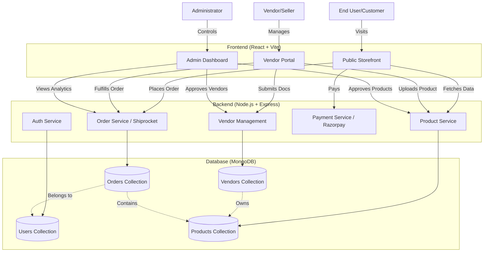

# Siraba Organic Ecommerce - Documentation

## 1. Idea of Website
 **Siraba Organic Ecommerce** is a comprehensive multi-vendor marketplace dedicated to organic products, primarily saffron and spices. It bridges the gap between organic farmers/producers (Vendors) and health-conscious consumers (Users).
 
 **Key Concept:**
 - **Multi-Vendor Platform:** Allows third-party vendors (farmers, distributors) to register, undergo strict compliance checks, and sell their organic products alongside the platform's own inventory.
 - **Quality Assurance:** Emphasis on transparency and certification (Organic, FSSAI, GST) to ensure trust.
 - **B2B & B2C:** Supports individual customer purchases and potential bulk business transactions.

---

## 2. Frontend Routes
The frontend is built with **React (+Vite)** and uses `react-router-dom` for navigation.

### Public Routes
- `/` - Home Page
- `/shop` - Shop All Products
- `/shop/vendor/:slug` - Specific Vendor Storefront
- `/product/:slug` - Product Details Page
- `/cart` - Shopping Cart
- `/our-story` / `/about-us` - Brand Story
- `/why-siraba` - Value Proposition
- `/certifications` - Compliance & Quality Certificates
- `/b2b` - Business to Business Inquiries
- `/blog` - Blog List
- `/blog/:slug` - Single Blog Post
- `/contact` - Contact Support
- `/track-order` - Order Tracking Page
- `/saffron`, `/traceability`, `/journal` - (Coming Soon features)

### Authentication & User Pages
- `/login` - User Login/Register
- `/account` - User Dashboard (Profile, Orders, Addresses)
- `/checkout` - Secure Checkout
- `/order-success` - Post-purchase Confirmation
- `/forgot-password` - Password Recovery
- `/reset-password/:resetToken` - Reset Password Form

### Vendor Portal Routes
- `/vendor` / `/vendor/intro` - Vendor Landing/Intro
- `/vendor/login` - Vendor Login
- `/vendor/register` - Vendor Registration
- `/vendor/onboarding` - Multi-step Onboarding Process (Business, Address, Bank, Docs)
- `/vendor/dashboard` - Main Vendor Dashboard
- `/vendor/subscription` - Vendor Subscription Plans

### Admin Routes
- `/admin` - Admin Login
- `/admin/dashboard` - Admin Analytics & Management Dashboard
- `/admin/blogs` - Blog Management List
- `/admin/blogs/new` - Create Blog Post
- `/admin/blogs/edit/:id` - Edit Blog Post

---

## 3. Backend Routes
The backend is powered by **Node.js & Express**, serving APIs at `/api`.

### Core APIs
- `/api/auth` - User authentication (Register, Login, Profile)
- `/api/products` - Product fetching, searching, and filtering
- `/api/orders` - Order placement, history, and status updates
- `/api/cart` - Server-side cart management
- `/api/upload` - File uploading service (Images, Docs)
- `/api/inquiries` - Contact form submissions
- `/api/payment` - Payment gateway integration (Razorpay)
- `/api/coupons` - Discount code management

### Vendor APIs
- `/api/vendors` - Vendor auth, profile, and management
- `/api/vendors/products` - Vendor-specific product CRUD
- `/api/vendors/inventory` - Stock and pricing management
- `/api/vendors/orders` - Vendor-specific order processing
- `/api/vendors/invoices` - Invoice generation for vendors
- `/api/vendor-messages` - Communication system

### Admin APIs
- `/api/admin` - Comprehensive admin controls (Users, Vendors, Products)
- `/api/admin/vendors` - Approve/Reject vendors, View compliance docs
- `/api/admin/analytics` - Platform-wide statistics (Revenue, Sales, Growth)
- `/api/blogs` - content management

### Utility APIs
- `/api/gst` - Public GST verification/utils
- `/api/notifications` - System notifications
- `/api/cache` - Redis/Memory cache management

---

## 4. User Actions (Customer)
A standard user on the platform can:
1.  **Browse & Search:** Filter products by category, price, and vendor.
2.  **Purchase:** Add items to cart and checkout using Razorpay (or COD).
3.  **Manage Account:** Update profile, address book, and view order history.
4.  **Track Orders:** Real-time tracking of shipment status.
5.  **Returns & Refunds:** Request returns for damaged/incorrect items.
6.  **Review:** Rate and review purchased products.
7.  **GST Invoice:** Claim GST credit by providing their GST number during checkout.

---

## 5. Vendor Actions
A registered vendor can:
1.  **Onboard:** Complete a strict KYC process (GST, FSSAI, Bank Details).
2.  **Manage Products:** Add new products, update pricing, and manage stock (Inventory).
3.  **Process Orders:** View assigned orders, mark as packed/shipped, and generate labels.
4.  **Dashboard Analytics:** View sales performance, revenue, and top-selling items.
5.  **Wallet:** Track earnings, view commission deductions, and request payouts.
6.  **Storefront:** Customize their public shop page (Logo, Description).

---

## 6. Admin Actions
The platform administrator has full control:
1.  **Vendor Approval:** Review vendor applications and compliance documents (Approve/Reject).
2.  **Product Approval:** Vetting vendor-uploaded products before they go live.
3.  **Order Oversight:** View all platform orders and intervene in disputes.
4.  **Content Management:** Create and edit blog posts using a rich text editor.
5.  **Analytics:** Access high-level financial reports (Gross Revenue, Net Profit, Vendor Payouts).
6.  **User Management:** Manage user roles and block suspicious accounts.

---

## 7. System Design (Mermaid.js)

---

## 8. How the Whole System Works (Workflow)

1.  **Vendor Registration:**
    *   Vendor signs up -> Submits Business Info & Compliance Docs.
    *   Admin reviews docs in Admin Panel -> Approves Vendor.
    *   Vendor gains access to Dashboard -> Adds Products.
    *   Admin approves Products -> Products appear in Shop.

2.  **Order Flow:**
    *   User browsing triggers `GET /api/products`.
    *   User adds to Cart -> Checkout -> Payment (Razorpay).
    *   **Order Created:**
        *   System splits order items by Vendor.
        *   `Order` document created for User.
        *   `VendorOrder` documents created for each relevant Vendor.
    *   **Fulfillment:**
        *   Vendor sees new order in Portal.
        *   Vendor accepts -> Packs -> Marks "Shipped" (Shiprocket API integrated).
    *   **Delivery:**
        *   User tracks order via Tracking Number.
        *   Order marked "Delivered".

3.  **Financial Settlement:**
    *   Payment is collected by Platform (Admin).
    *   Vendor Wallet is credited (Sales Price - Commission).
    *   Payout runs periodically to transfer funds to Vendor's Bank Account.

---

## 9. Tech Stack
Detailed Breakdown of technologies used.

### Frontend
*   **Core:** React 18, Javascript (ES6+)
*   **Build Tool:** Vite (Fast HMR & Bundling)
*   **Styling:** Tailwind CSS v4, Vanilla CSS
*   **Animations:** GSAP (GreenSock)
*   **Routing:** React Router DOM v6
*   **HTTP Client:** Axios
*   **Real-time:** Socket.io-client
*   **Icons:** Lucide React
*   **Rich Text:** React Quill

### Backend
*   **Runtime:** Node.js
*   **Framework:** Express.js v5 (Modern routing)
*   **Database:** MongoDB (via Mongoose ODM)
*   **Authentication:** JSON Web Tokens (JWT), BcryptJS
*   **File Handling:** Multer (GridFS/Local)
*   **Real-time:** Socket.io
*   **Email:** Nodemailer
*   **PDF Generation:** Puppeteer (for Invoices)
*   **Security:** Helmet, Express-Rate-Limit, XSS-Clean, Mongo-Sanitize, CORS

### External Services
*   **Payments:** Razorpay
*   **Logistics:** Shiprocket (Integrated in logic)
*   **Deployment:** Vercel (Frontend), Railway/Render/Vercel (Backend support implied)
